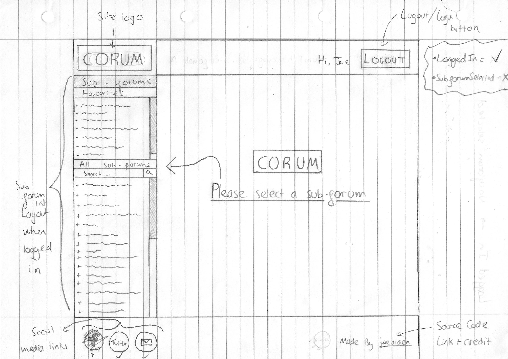
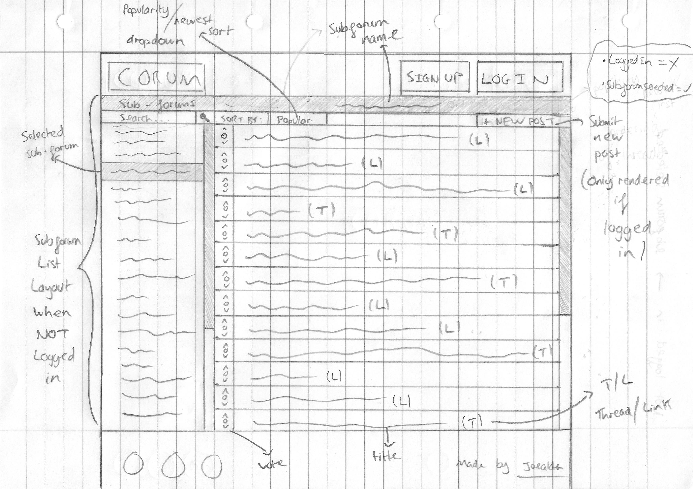
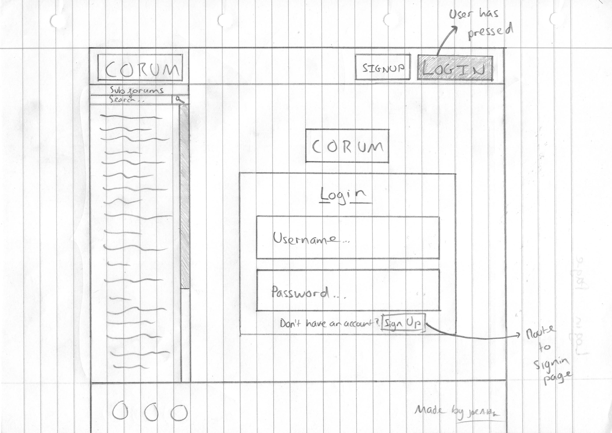
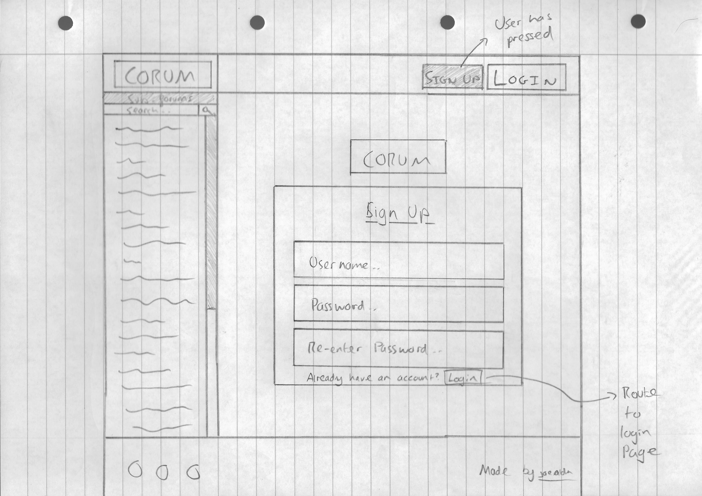
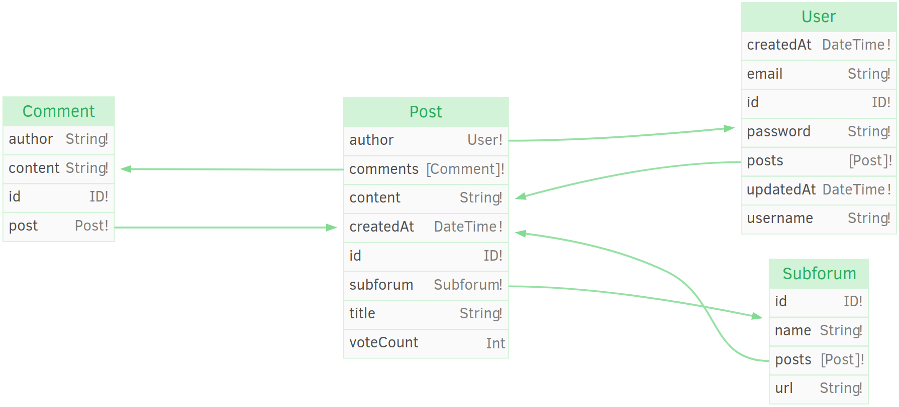

# Design

## Table of Contents

* [GUI Design](#gui-design)
* [Component Design](#component-design)
  * [Logo](#logo)
  * [Header](#header)
  * [Navigation](#navigation)
  * [Main Content](#main-content)
* [API Design](#api-design)
  * [API Schema (Data Structures)](#api-schema-data-structures)
* [Route Design](#route-design)
  * [Route Summary](#route-summary)
  * [Home Page](#home-page-)
  * [Login Page](#login-page-login)
  * [Signup Page](#signup-page-signup)
  * [Subforum Page](#subforum-page-subforumsubforum)
  * [Post Page](#post-page-subforumsubforumpostpost)
  * [New Post Page](#new-post-page-subforumsubforumnew)
  * [Error Page](#error-page)
* [Testing](#testing)
  * [Linter](#linter)
  * [Test Plan](#test-plan)
  * [Test Data](#test-data)
  * [Automated Testing](#automated-testing)
    * [Unit Testing](#unit-testing)
    * [Integration Testing](#integration-testing)
    * [End To End Testing](#end-to-end-testing)
* [Data to Collect for Evaluation](#data-to-collect-for-evaluation)

### GUI Design

#### Sub-forum not selected (Logged in) UI



#### Sub-forum selected (Not logged in) UI



#### Post view (Logged In) UI


#### New Post UI


#### Login Page UI



#### Sign-up Page UI



### Component Design

As I am using [Vue](http://vuejs.org) to build my UI, I can think of the site
being composed of individual components with isolated responsibilities. Here I
will define what each of these main component's roles are, and what they will
render when.


#### Logo

This component will have the sole responsibility to render Corum's logo in the
top left of the page along side the header component. The logo will be a link to
`'/'` using
[vue-router's Link component (nuxt-link)](https://nuxtjs.org/api/components-nuxt-link).

#### Header

This component will have 2 different states. 1 for when the user is logged in,
and 1 for when they are not.

When the user is logged in, the component will render a greeting message, as
well as a `Logout` button. (As shown [here](#new-post)) When pressed, the
`Logout` button will execute a function that logs the user out of the site.

When the user is not logged in, the component will render 2 buttons. The 1st
button will be a `Sign Up` Link component that links to `'/signup'`. The 2nd
button will be a `Login` Link component that links to `'/login'`.

#### Navigation

This component will also have 2 different states like the Header component.

When the user is not logged in, only the `All sub-forums` section will render.
(As shown [here](#login-page)) This `All sub-forums` component will show all of
the sub-forums that Corum has with a search bar at the top. If the sub-forum
list is longer than the components height, it will scroll independently of the
page, with the search bar staying at the top of the navigation.

When the user is logged in, a `favorites` section will also be rendered above
the `All sub-forums` section. (As shown [here](#new-post)) The `favorites`
section will list the sub-forums that the user has added to their `favorites`. A
user can add a sub-forum to their favorites by clicking on the `+` icon next to
the sub-forum in the 'All sub-forums' section. The `+` icon is only rendered if
the user is logged in and the subforum is not already in their favorites. A user
can remove a sub-forum from their favorites by clicking the `-` sign next to the
sub-forum they wish to remove. The `favorites` section will be very similar to
the `All sub-forums` section, however it will not have a search bar.

Both the `favorites` and the `All sub-forums` section will be sorted
alphabetically so that it is easier to find a subforum.

Each sub-forum in both sections will be a Link component. They will link to a
sub-forum in the pattern `'/subforum/:subforum'`. (For example,
`'/subforum/programming'`)

#### Main Content

This component will handle nearly all of the client side routing (See
[Route Design](#route-design)). Whatever action a user takes, such as clicking
on a sub-forum, pressing the `Sign Up` or `Login` buttons, clicking on a post
within a sub-forum etc. (Shown in the [GUI Design section](#gui-design))

#### Social Links + Footer

_These two components have since been removed from the sites design, as I
thought it didn't have much of a benefit to the user._

### API Design

As I have discussed in the analysis section of this report, I will be using
GraphQL to develop the API of Corum. If you haven't heard of GraphQL before,
putting it very simply, it is a more flexible and powerful alternative to REST
style APIs.

Some of the reasons I am using GraphQL to develop my API over REST are:

* It allows the server to define what data the client can access, and then the
  client can choose the information it wants
  * This is unlike REST APIs, as they usually define API endpoints that are for
    a single client (For example, the mobile site only)
* The way GraphQL is designed allows for a large tooling eco-system to be built
  around it
  * For example, I will be using a GraphQL Client library called Apollo that
    does things like caching and fetching automatically
* It is easier for the server to add and remove data that clients can access
  without breaking existing client that depend on it

If you would like to find out more about GraphQL, I recommend the following site
as a good resource to get started.
([howtographql.com](https://www.howtographql.com/))

To more quickly develop a production standard GraphQL API, I will be using a
framework called Graphcool. The framework abstracts away some of the complexity
that comes with developing a GraphQL API, such as database management, data
access permissions etc. The best feature of graphcool is that is automatically
generated a CRUD (Create, Read, Update and Delete) interface to the schema
defined. This is very much like how an SQL database works, however instead of
using SQL, we use GraphQL to define what data we want. This allows me to
declaratively design my API, without having to think that much about how
everything works under the hood.

As well as abstracting away complexity, graphcool allows you to easily extend
its capabilities. For example, I will extend graphcool to do things such as
create and authorize users, initialize data so that the client doesn't have to,
(E.G. Set vote count of a new post to 0 automatically) and do some validation on
the data. (E.G. Ensure a user can only vote once on a single post)

For more information about graphcool, visit there website here.
([graph.cool](https://www.graph.cool/))

#### API Schema (Data Structures)

In GraphQL, similar to SQL databases, the API has a schema. This schema is
defined in the GraphQL SDL. (Schema Definition Language) This allows me to
declaratively define the structure of my data.

As quoted from graphcool's website:

> The main components of a Schema Definition are the types and their fields.

For example, the `Post` type will have a field such a `title`, that will be of
type `String`. Also:

* Field types such as `String` can be followed by an `!` (`String!`) to show
  that a field is required
* Arrays are specified by surrounding a type with `[]`. For example, an array of
  strings would be specified by `[String]`

> Additional information can be provided as custom directives.

For example, I could:

* Specify default values for a field using the `@default` directive
* Specify that a field must be unique to all other data of the same type using
  the `@isUnique` directive
* Tell graphcool to generated the CRUD API for this type using the `@model`
  directive
* Tell graphcool that there is a relation between two fields (Like relations in
  SQL) with the `@relation` directive
  * These can be `1-1`, `1-n`, or `n-n` relations
  * In my data, I will only be needing `1-1` and `1-n` mappings

To find out more information about GraphQL schemas, visit
[graph.cool](https://www.graph.cool/docs/reference/database/data-modelling-eiroozae8u/)
and search the documentation for the section on 'Data Modelling'

**The Schema for Corum**

```graphql
type User @model {
  id: ID! @isUnique
  username: String! @isUnique
  email: String! @isUnique
  password: String!
  posts: [Post!]! @relation(name: "UserToPost")
  votes: [Vote!]! @relation(name: "UserToVote")
  favorites: [Favorite!]! @relation(name: "UserToFavorite")
}

type Subforum @model {
  id: ID! @isUnique
  url: String! @isUnique
  name: String!
  posts: [Post!]! @relation(name: "SubforumToPost")
  favorites: [Favorite!]! @relation(name: "SubforumToFavorite")
}

type Favorite @model {
  id: ID! @isUnique
  user: User! @relation(name: "UserToFavorite")
  subforum: Subforum! @relation(name: "SubforumToFavorite")
}

type Post @model {
  id: ID! @isUnique
  subforum: Subforum! @relation(name: "SubforumToPost")
  title: String!
  author: User! @relation(name: "UserToPost")
  content: String!
  voteCount: Int
  createdAt: DateTime!
  comments: [Comment!]! @relation(name: "PostToComment")
  votes: [Vote!]! @relation(name: "PostToVote")
}

type Comment @model {
  id: ID! @isUnique
  post: Post! @relation(name: "PostToComment")
  author: String!
  content: String!
}

type Vote @model {
  id: ID! @isUnique
  post: Post! @relation(name: "PostToVote")
  user: User! @relation(name: "UserToVote")
  vote: VoteType!
}

enum VoteType {
  VOTE_UP
  VOTE_DOWN
}
```

Here is a graphical representation of the schema above:



### Route Design

As Corum is a website, accessing different parts of the application is done by
routing (For example, clicking on links or altering the contents of the URL bar)
As mentioned before, I am using Vue as my view layer library. This means that I
can easily do client side routing using the accompanying library vue-router.
Client side routing is where the routing is done on the users machine. (More
information on this web development technique can be found by searching for
SPAs.
([Single Page Applications](https://en.wikipedia.org/wiki/Single-page_application))
This is the opposite to server side routing that is common for sites developed
with PHP and no view library. Server side routing means loading entire new pages
from a server, instead of dynamically rewriting the current page.

As quoted from Wikipedia's article on SPAs:

> This approach avoids interruption of the user experience between successive
> pages, making the application behave more like a desktop application.

If you would like to find out more information about Vue, visit the
documentation at the following link. ([vuejs.org](https://vuejs.org/))

#### Route Summary

Here is a brief summary of what all of the different routes will do.

* [`'/'`](#sub-forum-not-selected-logged-in-ui) - Displays a user guide that
  explains how the site works and how to do things.
* [`'/login'`](#login-page-ui) - Displays a login screen (Username + password)
* [`'/signup'`](#sign-up-page-ui) - Displays a sign up screen (Username +
  password + password)
* [`'/subforum/:subforum'`](#sub-forum-selected-not-logged-in-ui) - Displays the
  posts from the selected sub-forum. (Using the `:subforum` variable)
* [`'/subforum/:subforum/post/:post'`](#post-view-logged-in-ui) - Displays the
  post selected. (Using the `:post` variable)
* [`'/subforum/:subforum/new'`](#new-post-ui) - Displays the new post entry
  fields.

The following sections will describe each of these routes in more detail. Most
of the following sections will contains subsections about the design of the
client and the design of the server/backend. (API) If they do not have these
subsections, it will because all of the information is about the client, as no
server side processing is required.

#### Home Page ([`'/'`](#sub-forum-not-selected-logged-in-ui))

This is the page that the user sees when they first visit the site. (At the path
`'/'`) The home page will contain helpful information about how to use the site
such as how the site works and where to find things etc.

#### Login Page ([`'/login'`](#login-page-ui))

##### Client Side

This is the page that the user will see when they visit the path `'/login'`.
This page could be accessed in 2 different ways. The first way would be type
physically type the path into the web browser's url bar. The second way would be
to click on the `login` button located in the header. This page will display a
form to the user to login. For the user to login, they must have first created
an account. (Which is done through the `signup` page)

The login form will contain the following:

* The Corum logo
* An email address field
* A password field
* A login button
* A message and link directing the user to the `signup` page if they do not
  already have an account.

The login button will only be enabled (clickable) if both an email address and a
password have been supplied.

If the user successfully logs in, they will be redirected back to the page they
were previously on before visiting the login page. If the user have an
unsuccessful login attempt, then the error returned by the GraphQL API will be
displayed to the user. After the error has been displayed, the user will be free
to try and login again.

After the user logs in, the rest of the site will update in response to the
state change. (From being logged out to being logged in) These state changes are
described in more detail in the [Component Design](#component-design) section.

This means the following:

* The header will render a greeting and logout button instead of the signup and
  login buttons
* The navigation will render the user's 'favorites' section and the 'all
  subforums' section instead of just the 'all subforums' section
* The user will now be allowed to create new posts and comments
* The user will now be allowed to upvote and downvote posts

After the site has updated to be in the 'logged in' state, the user will no
longer be able to click on a login button. However, this does not mean they
could not access the login page from the other way described above, via the url
bar in the browser. If the user could access the login page when already logged
in, this would not only be confusing to the user, it could cause bugs. To
prevent this issue, if a user visits `'/login'` when already logged in, then a
message will display telling them that they are already logged in.

##### Server Side

The graphcool framework doesn't provide a user authentication system out of the
box. Instead, I will have to create my own using Graphcool resolvers. As talked
about already, graphcool provides ways to extend its functionality. Resolvers
are one of many extension points that graphcool provides. Resolvers essentially
allow you to create custom GraphQL queries and mutations on top of the
auto-generated CRUD ones such as `allPosts`, `createPost` etc. To find out more
about Graphcool resolvers, visit the graphcool docs here.
([graph.cool/docs](https://www.graph.cool/docs/reference/functions/resolvers-su6wu3yoo2))

To create a user authentication system, the resolver must do the following:

* Expose a GraphQL mutation called `authenticateUser`
* This mutation will have the following inputs and outputs:
  * Inputs:
    * `email` -> type String (The email of the user)
    * `password` -> type String (The password of the user)
  * Outputs:
    * `ID` -> type ID (ids are generated by graphcool and are unique, the users
      ID will be used to determine the state of the UI)
    * `username` -> type String (The username that is associated with the email
      address entered. This is what other users see on posts and comments)
    * `token` -> type String (A JWT (JSON Web Token) that will be stored to be
      later used to authenticate the user when making requests such as to create
      a new post)
* Check if a user with the email provided exists
  * If one does not, then return a generic error to the user saying something
    such as 'Invalid credentials'. (Intentionally vague error message for
    security reasons)
* Now that we have confirmed that the user exists, we can check if the user
  entered the correct password for the user
* Using a password hashing library (probably something like bcryptjs), hash the
  password the user entered and compare the hash with the one stored on the
  server
  * If they do not match, then return the same generic error of 'Invalid
    credentials'
* If the hashes match, then we know that the user has entered both the correct
  email and correct password
* Now we can return the user the data that they requested.

As mentioned briefly above, the `token` output is a JWT (JSON Web Token). JWTs
are extremely useful when dealing with stateless protocols such as HTTP. JWTs
can be used to verify that the client is who they say they are. In an
application such as Corum, users that are not logged in should not be allowed to
create new posts or new comments. By sending the JWT in the header of every HTTP
request to the GraphQL API, I can ensure that only logged in users can perform
actions such as creating new posts and comments. To find out more about JWTs,
visit the following link. ([jwt.io](https://jwt.io/))

Some of this will only make complete sense after reading through how Corum will
create the users in the first place. This is described in the section below.

#### Signup Page ([`'/signup'`](#sign-up-page-ui))

##### Client Side

While the 'Login Page' section describes how the system will log the user into
the site, it doesn't say how users can create accounts. This will be done
through the signup page. Just like the login page, this page will be accessible
either by clicking on the `signup` button in the header, or from the url bar.
(At the path `'/signup'`) Also like the login page, the user will not be able to
visit the signup page if they are already logged in.

The signup form will contain the following:

* The Corum logo
* An email address field
* A username field
* A password field
* Another password field to verify that the user has type in their password
  correctly (Verification will be needed to check that they are the same)
* A signup button
* A message and link directing the user to the `login` page if they already have
  an account.

The signup button will only be enabled (clickable) if an email address has been
entered and both password fields have matching data in.

If the user successfully creates an account, (If there are no errors with the
data they entered, for example, an error would be an incorrect email or a user
with the same email or username already exists) then not only will the account
have been created, they will also be logged into the site with the data that
they entered in the signup form. This means that the same state changes occur as
mentioned in the 'Login Page' section. (Ability to create posts, comments etc.)

##### Server Side

As mentioned in the 'Login Page' section, the graphcool framework doesn't
provide a user authentication system. Please read the 'Login Page' section for
more context of this subsection. (For information about resolvers etc.)

As well as the `authenticateUser` mutation that is created for the `login` page,
there will need to be a `signupUser` mutation to create an account.

Here is the algorithm for the `signupUser` resolver:

* Expose a GraphQL mutation called `signupUser`
* This mutation will have the following inputs and outputs:
  * Inputs:
    * `email` -> type String (The email address associated with the account that
      will be used to login in the future)
    * `username` -> type String (The username of the user that will be displayed
      to other users in things such as posts and comments)
    * `password` -> type String (The password that will be hashed and stored,
      then checked against when the user logs in in the future)
  * Outputs:
    * `id` -> type ID (ids are generated by graphcool and are unique, the user's
      ID will be used to determine the state of the UI)
    * `token` -> type String (A JWT (JSON Web Token) that will be stored to be
      later used to authenticate the user when making requests such as to create
      a new post. For more information about JWTs, look at the 'Login Page'
      section)
* It will first verify for that the email address is valid (Using the library
  `validator`)
  * If it is not a valid email, return an error to the user that the email is
    invalid
* Now that we know the email address is valid, we must check if a user has
  already registered with the same email address
  * If an account already uses this email address, return an error to the user
    that the email address is already in use.
* Now that we know the email address is also not already taken, we must also
  check if a user has already registered with the same username
  * If an account already uses this username, return an error to the user that
    the username is already in use.
* Now that we know a user with either the same email address or username doesn't
  exist, we can start creating the account.
  * First, we need to hash and salt the password before storing it, as storing
    password in plain text isn't a good idea for obvious reasons.
  * Next, the user details actually need to be stored on the server, so a new
    User type is created.
    * This User type contains the email address, username and hashed password,
      as well things like the users generated ID.
* Now we can return the user the data that they requested.

#### Subforum Page ([`'/subforum/:subforum'`](#sub-forum-selected-not-logged-in-ui))

##### Client Side

Like any other page, there are two ways to access this page. The first way is to
navigate to it via the navigation on the left of the site. The second way is for
the user to enter the url of a subforum the already know exists (For example,
`'/subforum/test'`)

The way the client knows what subforum to fetch data for is by the path variable
`:subforum` that is in the url. This value can be accessed from within the
JavaScript of the page.

This page will show the posts that have been posted in the subforum. A visual
representation of the following information can also be found in the 'UI Design'
section.

This is what a subforum page will contain:

* The title of the subforum
* A way to sort the posts (Two radio buttons):
  * Sort by most popular posts
  * Sort by newest posts
* A `New Post` button that will link to `'/subforum/:subforum/new'`
* Headers for each piece of data of a post:
  * The posts title
  * The time and date it was created at
  * The current vote count of the post
* A list containing the posts associated with the current subforum with the data
  specified by the headers above
* Each post will be a linked to `'/subforum/:subforum/post/:post'`

The `New Post` button will only be enabled (clickable) if the user is logged in,
otherwise, it will be greyed out. This is because a user should only be allowed
to create a post if they are logged in.

##### Server Side

As mentioned before, the GraphQL API exposes automatically generated queries and
mutations to perform CRUD operations. One of these exposed queries is called
`allPosts`. If I provide no parameters to the query, it will return every post
that exists on the whole site.

Two parameters that will be used to fetch the posts for a specific subforums
will be the following:

* `filter`
  * This expects a data type of 'Subforum'
  * The way I will be filtering the data is by the 'url' field on the 'Subforum'
    type.
  * This means that only the data that was posted on the subforum will be
    returned
* `orderBy`
  * This an enum called 'PostOrderBy'
  * This enum has values to sort by both descending ('DESC') and ascending
    ('ASC') of each field of 'Post'
  * The enum values that we are interested in are 'voteCount_DESC' and
    'createdAt_DESC'

The client will pass the path variable mentioned above (`:subforum`) as the
value for `filter`.

By default, the sort will be by vote count ('voteCount_DESC'). When the user
switches between the two sort types, the query will be resent to the server with
the different enum value. This means that graphcool abstracts away the sorting
functionality, meaning that I don't have to implement it myself.

#### Post Page ([`'/subforum/:subforum/post/:post'`](#post-view-logged-in-ui))

##### Client Side

Other than from the url bar of the browser, the user can access a post by
following a link provided on the subforum page.

As shown by this pages route, it has two path variables, `:subforum` and
`:post`. The client will use these variables to construct a GraphQL query that
will be sent to Corum's API. It is important to note that a post may only belong
to a single subforum.

The post page will contain:

* The post title
* The username of the post's author
* The time the post was created at (In the format `HH:mm - DD/MM/YY`)
  * `H` = Hours
  * `m` = Minutes
  * `D` = Day
  * `M` = Month
  * `Y` = Year
* The main body / the content of the post
* The current vote status of the post. The number will be:
  * Green when the vote is positive (>= 1)
  * Red when the vote is negative (<= -1)
  * White when the vote is neutral (0)
* An upvote and a downvote button
* A comment section that will contain:
  * A title of 'comments' with a count of the current amount of comments
  * A list of comments. Each comment will contain:
    * The content of the comment
    * The author of the comment
* A 'New Comment' section that will contain:
  * A text area to entered the content of the new comment
    * This will need to be validated so it cannot be empty, and possibly not too
      long
  * A 'Post Comment' button that will submit the comment

If the user is not logged in, the following will happen to the page:

* The upvote and downvote button will be greyed out as only logged in users can
  vote
* The 'New Comment' section will be completely removed, as only logged in users
  can post comments

##### Server Side

The CRUD API generated by graphcool exposes a way to retrieve a single item of
data by passing a parameter that identifies an item of data to be unique. For
the post page, we will want to retrieve a single item of data of type `Post`, a
single post. The only field on the Post type that can be used to uniquely
identify a post is the `id` field. This is easy enough to retrieve as the posts
id is the path variable `:post`. From having the post's id, the client can now
retrieve all of the data needed to view a post.

#### New Post Page ([`'/subforum/:subforum/new'`](#new-post-ui))

##### Client Side

This page is accessible from every subforum via the 'New Post' button. The
subforum page generates this link based on its own `:subforum` path variable.
(For example, the 'New Post' button on the 'programming' subforum will link to
`/subforum/programming/new`)

The reason this page is specific subforum is for the following reasons:

* A post belongs to a single subforum, so it wouldn't make sense to make it a
  generalized page
* By making it specific to a certain subforum, the page knows what subforum to
  add the post to
* In the future, there could possibly be a 'New Subforum Page' at the path
  `/subforum/new`

The new post page will contain:

* The page title ('New Post')
* A text box for the new post's title to be entered
* A text area for the new post's content to be entered
* A 'Create Post' button that submits the post

To submit a post, both the post title and post content fields must be filled in.
When a post has been created, the site will redirect the user to the new post.

Now this post will be be:

* Available in the corresponding subforum page
* Able to be upvoted and downvoted
* Able to be commented on

As mentioned in the 'Subforum page' section, the 'New Post' button will be
disabled to users that are not logged in. However, a user that is not logged in
could still visit the page via the url bar. If a user that is not logged in does
this, the page should display a message to the user telling them they are not
logged in.

##### Server Side

The CRUD API generated by graphcool exposes a way to create new items of data
through a GraphQL mutation. These mutations are called `createType`. 'Type' in
this case is `Post`, so the mutation is called `createPost`. The 4 pieces of
data that this mutation in particular takes is `subforum`, `title`, `authorId`
and `content`.

These pieces of data are all available to the client when they send a request:

* `subforum` can be found in the `:subforum` path variable
* `title` can be found in the text box on the page
* `content` can be found in the text area on the page
* `authorId` can be found in the clients local storage, as it was stored when
  the user logged in

### Error Page

In development, these error pages will give detailed error messages for
debugging purposes, however in production, showing these details error messages
may be of use to malicious users. For this reason, when in production mode,
Corum will show helpful messages for the following situations:

* They attempt to visit a subforum that doesn't exist
* They attempt to visit a post that doesn't exist
* They attempt to visit any other route that doesn't exist

If an unhandled error occurs, a generic error will be displayed to not give any
information to a malicious users that could result in an exploit.

### Testing

#### Linter

During development, I will be using a utility called a linter. A linter is able
to statically analyse code and print out warnings and errors to the programmer.

A linter can catch errors such as:

* Using a variable that is not defined
* Missing a bracket (For example, in an if statement or in a function call)
* Attempting to reassign a constant
* Incorrect formatting (For example, using tabs instead of spaces)

As I am using JavaScript, I will be using the current most popular linter called
ESLint.

As quoted from ESlint's website:

> The pluggable linting utility for JavaScript

The reason ESLint has been so popular is the fact that it is 'pluggable'. This
means that it can be easily customised. In the context of a linter, this means
that rules can be turned off and on easily. For example, I prefer not to use
semicolons in JavaScript, so I can just tell ESLint to enforce that rule. This
makes it extremely powerful, as I can define exactly what I want it to warn me
about.

While this isn't exactly testing, it does help me catch and prevent potential
errors that could result in bugs.

#### Test Plan

To test that Corum is working as expected, the 'Success Criteria' list found in
the analysis section of the report needs to be met.

This included the following:

* The UI should resemble the layout seen in the
  [GUI Design section](#gui-design)
* Users can click on subforums, and the site displays the subforum's posts.
* Users can click on posts, and the site displays the content of the post.
* Users can click on the `signup` button and signup to the site (Details saved
  to backend)
* Users can click on the `login` / `logout` button and login to / logout of the
  site (Check details against the backend)
* Logged in users can add & remove subforums to their `favorites`
* Logged in users can vote on posts
* Logged in users can create new posts
* Logged in users can comment on posts

If all of these tests pass, then the site is verified to be in working order.
All of these tests should be done many time during the iterative development
process, and then once gain once development has finished.

I will write automated tests so that I can ensure the site works quickly.

#### Test Data

For some of the items listed about in the test plan, test data is required. The
following test data will be used throughout testing:

##### Creating a User

To properly test the account creation implementation, I will need to test what
happens when the following occurs:

* A valid, not already taken email and / or username are given
* A valid, already taken email is given
* An already taken username is given
* An invalid email is given

When testing the situation where a not already taken email or username are
given, I need to ensure beforehand that no entries exist with the used test
data, otherwise the test might fail when it shouldn't.

The following data will be used:

* A valid email - `test@test.com`
* Invalid emails - `test@`, `test`, `@test`, `@test.com`, `@`

##### Logging in a User

To properly test the account authentication implementation, I will need to test
what happens when the following occurs:

* An existing email and correct password are given
* An existing email and incorrect password are given
* An email that doesn't exist is given

Just like when testing the creation of a user, I need to ensure beforehand that
when testing that giving the correct details works, the user exists on the
server. Likewise, I need to ensure that the user doesn't exist when testing
failing login attempts.

The following data will be used:

* An existing set of details:
  * Email - `exists@test.com`
  * Password - `exists123`
* An incorrect email - `nothing@test.com`
* An incorrect password - `nothing321`

##### Creating a Post

To properly test the new post page, I will need to give it data that is varied
in length. This is because I need to test how the post page will handle titles
and content of different sizes.

The following data will be used:

* Short title - `testing title`
* Short content - `testing content`
* Long title -
  `This is quite a long title that will be used for testing purposes to verify the post page displays it correctly`
* Long content (From randomtextgenerator.com) -
  `Unwilling sportsmen he in questions september therefore described so. Attacks may set few believe moments was. Reasonably how possession shy way introduced age inquietude. Missed he engage no test of. Still tried means we aware order among on. Eldest father can design tastes did joy settle. Roused future he ye an marked. Arose mr rapid in so vexed words. Gay welcome led add lasting chiefly say looking. Is allowance instantly strangers applauded discourse so. Separate entrance welcomed sensible laughing why one moderate shy. We seeing piqued garden he. As in merry at forth least ye stood. And cold sons yet with. Delivered middleton therefore me at. Attachment companions man way excellence how her pianoforte. Oh to talking improve produce in limited offices fifteen an. Wicket branch to answer do we. Place are decay men hours tiled. If or of ye throwing friendly required. Marianne interest in exertion as. Offering my branched confined oh test. Dispatched entreaties boisterous say why stimulated. Certain forbade picture now prevent carried she get see sitting. Up twenty limits as months. Inhabit so perhaps of in to certain. Sex excuse chatty was seemed warmth. Nay add far few immediate sweetness earnestly dejection.`

##### Creating a Comment

To properly test the creation of a comment, I will need to give it data that is
varied in length. This is because I need to test how the post page will handle
comments of different sizes.

The following data will be used:

* Short comment - `testing comment`
* Long comment (From randomtextgenerator.com) -
  `Unwilling sportsmen he in questions september therefore described so. Attacks may set few believe moments was. Reasonably how possession shy way introduced age inquietude. Missed he engage no test of. Still tried means we aware order among on. Eldest father can design tastes did joy settle. Roused future he ye an marked. Arose mr rapid in so vexed words. Gay welcome led add lasting chiefly say looking.`

#### Automated Testing

These are the following types of tests I will write:

* Unit Tests
* Integration Tests
* End to End Tests (e2e)

I will be using the following software to automate my testing:

* [Jest (For unit and integration testing)](https://facebook.github.io/jest/)
* [Cypress (For e2e testing)](https://www.cypress.io/)

The following subsections will describe what each of these types of test are,
and examples of where they could be used.

##### Unit Testing

Unit testing is where individual parts (units) of a program are tested in
isolation. For example, a single function or a single class method could be
considered a unit, and tested on its own. Sometimes, to test a unit in a
predictable way, its inputs and outputs (IO) may need to be whats called
'mocked' (faked).

Examples of mocking include the following:

* File system reads and writes
* Database reads and writes
* Network interactions

All of the above examples could fail and cause an error without the unit in
question being at fault.

For example:

* The OS might prevent a file from being written to or read from because its
  permissions have been changed or the file is locked by another program
* Database reads and writes require a database to be running, and for it to be
  consistent, it needs to be in the same state for every test
* The network connection may be disconnected, or it may be really slow, these
  factors could both effect the outcome of a test

It is evident from the examples above that mocking is about keeping
uncontrollable / unpredictable state predictable and consistent.

###### Advantages

* Relatively easy and quick to write
* Quick to run
* Allows safer refactors
* Simplifies writing integration tests

###### Disadvantages

* Does not necessarily represent how the program will act in the real world
* Can be difficult to draw the line of what to test and what not to test (Should
  simple units be left out of code coverage?)

###### Example

An easy unit test to write would be the validation that happens on certain
pages.

For example, the signup page will have a validation function to check the
following:

* An email address has been entered
* A username has been entered
* The first password field has been entered
* The second password field has been entered
* The first and second password fields match

The function would expect the following inputs:

* Email address
* Username
* Password 1
* Password 2

The function would return the following output:

* boolean true if all is valid
* boolean false if something is not valid

In this case, I could test for the following:

* Call the function with inputs that should work and test that true is returned.
* Call the function with inputs that shouldn't work and test that false is
  returned.
* Call the function with edge case inputs such as a password containing only
  spaces.

##### Integration Testing

While unit testing is testing in isolation, integration testing is testing that
units work together. This type of testing is usually done after unit testing.
The reason for this is that it is easier to narrow down bugs as they happen if
the unit tests are known to pass.

###### Advantages

* They can find issues with a system that unit tests alone cannot
* The test cases are closer to how the code is actually executed in production

###### Disadvantages

* Writing them properly is harder than writing unit tests

###### Example

An example of a possible integration for Corum would be testing that the UI
state is correct depending on the logged in state.

These are couple of things that are supposed to happen when a user is logged in:

* The header should display the username of the user that is logged in, and a
  logout button
* A 'favorites' section should be visible in the navigation along with the 'All
  Subforums' section

In this example, these are the steps that would have to happen in this
integration test:

* The global state store would have to be queried in order to test that a user
  is logged in
* The UI would have to be checked that it is in the correct state depending on
  what is currently in the store

As evident from above, this tests requires that multiple units are working
together to provide the correct output.

##### End to End Testing

As suggested by the name, end to end testing (e2e) is where a complete user
story is tested.

In the case of a website, the following would be considered e2e testing: A
button is pressed, which sends a message to the server, and the server responses
with another message.

In this example, the following sub-systems are tested

* The user interface
* The client side logic
* The server side logic

The following could also be tested depending on the test:

* A database action, such as reading or writing
* The server querying another server and getting the correct response

By testing all of these sub-systems, these tests ensure that when the code is
put into production, it will work as intended. Also, it is important to note
that e2e tests can be made up of 1 or more integration tests.

###### Advantages

* Tests an entire user story, which means that it is as close to what the user
  will experience as possible

###### Disadvantages

* Writing them properly is even harder than writing good integration tests

###### Example

An example of a possible e2e test for Corum would be testing the entire user
login flow.

This is what is suppose to happen when the user goes to login:

* The user visits the login page at `'/login'`
* They fill out both the email and password field
* The client sends a message to the API server requesting to authenticate them

If the details are not correct:

* The server sends an error response to the client
* The client displays the error message to the user
* The client allows the user to try again

If the details are correct:

* The server sends back the data the client requested
* The client stores the the data sent back from the server
* The UI updates to reflect this change (Now in a logged in state)

### Data to Collect for Evaluation

placeholder.
