# Development

## TODO

* Relate implementation back to design and user requirements
* Put new subforum page in design

## Table of Contents

* [Structure of the Project](#structure-of-the-project)
  * [Monolith vs Micro](#monolith-vs-micro)
  * [Client Architecture](#client-architecture)
    * [Vue](#vue)
    * [Nuxt](#nuxt)
    * [Apollo](#apollo)
    * [Production vs Development](#production-vs-development)
  * [API Architecture](#api-architecture)
    * [Graphcool](#graphcool)
* [Iterations during Development](#iterations-during-development)
  * [Version Control](#version-control)
  * [Iteration Stages](#iteration-stages)
  * [User and Stakeholder Feedback](#user-and-stakeholder-feedback)
* [Problems experienced](#problems-experienced)
  * [Client Problems](#client-problems)
  * [API Problems](#api-problems)
* [Testing During Development](#testing-during-development)
  * [Signup Page](#signup-page)
  * [Login Page](#login-page)
  * [Navigation](#navigation)
  * [Subforum Page](#subforum-page)
  * [Post Page](#post-page)
  * [New Post Page](#new-post-page)
  * [New Subforum Page](#new-subforum-page)
* [Code Analysis](#code-analysis)
  * [Client Analysis](#client-analysis)
  * [API Analysis](#api-analysis)

## Structure of the Project

### Monolith vs Micro

* Talk about how at the start, the API and the client were going to be built as
  a monolith project
* When I got further into development, I decided to separate the API and the
  client because:
  * Separation of concerns
  * As the API and client wouldn't be deployed together, it doesn't make sense
    to package them together
  * It meant that documenting and testing the projects was a simpler process
  * node_modules bundling issue
    * Javascript handles dependencies in the following way:
      * The file `package.json` contains information about the project
      * An important piece of information is the project dependencies
      * When installing the dependencies, (with the `yarn` command) they are
        placed in the `node_modules` folder
    * The API framework I am using, (graphcool) currently bundles the entire
      contents of the `node_modules` folder with the deployed code. This means
      that when the project was a monolith, all of the dependencies for the
      client were also being bundled with the API code. This was an issue
      because of the following:
      * The API would take up more storage space on the deployed server
      * It would take significantly more time to bundle the API before it was
        deployed. This meant that I was wasting time.
  * As the API code and the client code use different libraries and frameworks,
    it made sense for them to have different configuration and settings for the
    following:
    * ESLint, The code linter of my choice (The config file is called
      `.eslintrc.js`) The client code has to be browser compatible, whereas the
      API code had to be node.js compatible.
    * git ignores Git ignores tell git (the version control system of my choice)
      what it shouldn't allow to be committed to the repository. (config file is
      `.gitignore`) I wanted to ignore different files between the projects.
    * NPM scripts, the task runner of my choice. (located under the `scripts`
      section of `package.json`) When I ran a task such as `test`, I want
      different tests to be ran between projects.
    * Code editor settings for Visual Studio Code (vscode), my editor of choice.
      (Config files can be found inside of the `.vscode` directories in both
      projects) Vscode allows you to configure workspace settings for different
      projects, this includes things such as recommend editor extensions and
      their settings. For example, it wouldn't make sense to recommend any Vue
      related extensions for the API, as it doesn't use Vue.
  * This was made difficult when I had a monolith project

### Client Architecture

#### Vue

* Reference analysis and design sections
* Why use Vue over react vs nothing

##### Why use Vue?

* Abstracts away DOM operations
* Provides prebuilt solutions for common uses:
  * Routing (`vue-router`)
  * State Management (`vuex`)

#### Nuxt

* Describe what nuxt is
  * Framework built on top of nuxt
  * Inspired by next.js for react
  * Intends to provide a better developer experience

##### Why use Nuxt?

* Abstracts away a lot of configuration and boilerplate code
* Bakes in routing and state management
* Provides server side rendering (Makes initial load faster and allows for
  easier SEO)

##### How Nuxt Works

* CLI (Command Line Interface)
  * `nuxt` - Starts the development server
  * `nuxt build` - Builds the client for production
  * `nuxt start` - Starts a production server (Files must have been built)
* Folders used by nuxt
  * `layouts`
  * `pages`
  * `static`
  * `store`
* nuxt modules
  * `apollo`
  * `dotenv`
  * `font-awesome`
  * `pwa`
* nuxt.config.js

While nuxt provides a great abstraction on top of Vue and related libraries, it
is also very customisable and extensible. Nuxt provides a central way to
configure itself, through a file located at the

#### Apollo

* Describe what Apollo is (Reference design)
  * A GraphQL client that provide the following:
    * Middleware hooks (Used to add `Authentication` header when a user is
      logged in)
    * Data caching (Means less network fetches and faster responses)
    * Bindings for Vue (with the `vue-apollo` library)
* The way the client communicate with the API

#### Production vs Development

* Production vs development settings
  * Optimisations
    * Code minification
    * Turn off dev help
      * ESLint overlay (If something breaks, don't say exacting why)
      * Vue developer tools (That lets you explore info state)
      * Logging errors to the console (Why you don't want that in production)
      * Changing error page (Why)
    * Turn on service worker (With nuxt pwa module)

#### Configuration

* .env file

### API Architecture

#### Graphcool

* A way to quickly create a production ready GraphQL server
* Acts almost like a database, as it provides CRUD operation on the data
* The way this works is that it generates a CRUD API with GraphQL queries and
  mutations based on the schema you give it

##### Why Graphcool?

* Kind of like how Nuxt is the Vue, Graphcool is to a GraphQL server
* Means I do not have to reinvent the wheel.

##### How Graphcool Works

* CLI (Command Line Interface)
  * `gcf` (Stands from Graphcool Framework)
  * `gcf deploy` - Deploys the API to a graphcool server
  * `gcf playground` - Opens a web browser on a page that lets you explore and
    test your API
* Configuring Graphcool (Through the `graphcool.yml` file)
  * `types` - Provide the location of the API schema
  * `functions` - Define resolvers and hook functions
  * `rootTokens` - Define what functions have root privileges, this is used to
    perform further data mutations and querying data normal users can't (User
    password hash etc.)
  * `permissions` - Define permissions for data CRUD operations, for example,
    specify that only logged in users can create posts, create comments and
    vote. Or that no one it allowed to delete posts.

## Iterations during Development

### Version Control

* Used git for version control and uploaded to github

#### Why Version Control?

* Code is always safe (Present on github and on both my machines)
* Means that I can go back it time if something goes wrong and I just want it in
  working state
* Means that the development process was self documenting, as each change has an
  accompanying commit message

### Iteration Stages

* Talk about iterative development style
* Talk about each develop cycle as a 'module' (testing at the end of each)
* Implementing a dumb frontend (Mostly coding with just HTML and CSS at that
  point)
  * The landing page
  * The signup and login page
  * The subforum page
  * The post page
  * The new post page
  * The new subforum page
* Implementing the API
  * The `Subforum` datatype
  * The `Post` datatype
  * The `User` datatype
  * The `Comment` datatype
  * The `Vote` datatype
  * The `Favorite` datatype
* Implement the logic of the frontend to communicate with the API
  * The `Header` component changes state on login
  * The `Navigation` component loads in all subforums and changes on login state
  * The signup page creates a user and logs them in (with validation)
  * The login page logs a user in if their details are correct (validation)
  * The subforum page loads the posts from the correct subforum
  * The post page loads post details (name, author, content, comments etc.)
  * The new post page creates a new post and redirects the the new post
  * The new subforum page creates a new subforum and updates the navigation
* Ensure that the moderator knows that it all works as it should

### User and Stakeholder Feedback

placeholder

## Problems experienced

### Client Problems

* How to manage login state
* How to handle errors
* Updating state based on data mutations

### API Problems

* User account creation and authentication
* Setting the initial vote count of a post to 0 on creation
* Ensuring a user could only favorite a subforum once
* Ensuring a user could only vote once on a post
* Figuring out permissions

## Testing During Development

* Talk about testing during development (relate to automated tests)
* Say that these manual tests could have been automated with e2e / cypress
* However, they do not mean unit tests are pointless

### Signup Page

These also show the following:

* The url can be seen at the top (`/signup`)
* The Sign Up button in the header is highlighted correctly
* On submit, the sign up button is no clickable and says 'Please Wait...'

#### Successful Signup Attempt

* The user is redirected to the page they were on before if successful
* The logged in state has been changed (Show in navigation and header)
* It is assumed that the email and username are not already taken


#### Input validation

* Mention that the validation code can be found below (maybe link)
* The Sign Up button can only be pressed when:
  * All fields have been filled
  * The two passwords fields match
* In this GIF, it can be seen that the passwords do not match, as they of
  different length


#### Email is Already Taken

* The correct error message is displayed
* It is assumed that the email `test@test.com` is already taken
* It is assumed that the username `test12345` is not taken


#### Username is Already Taken

* The correct error message is displayed
* It is assumed that the username `test` is already taken
* It is assumed that the email `test123@test.com` is not taken

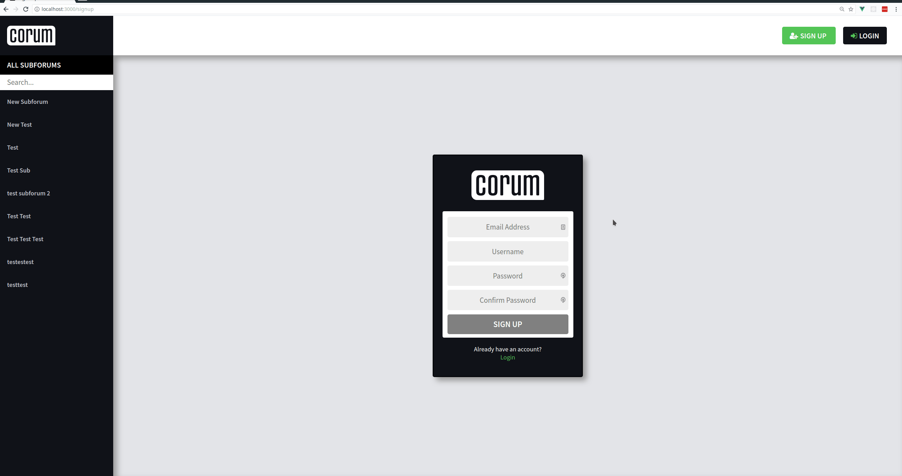

#### Email and Username are Already Taken

* The correct error message is displayed
* It is assumed that the email `test@test.com` is already taken
* It is assumed that the username `test` is already taken


#### Navigating to the Login Page

* The link provided on the signup page to the login page works


### Login Page

These also show the following:

* The url can be seen at the top (`/login`)
* The login button in the header is highlighted correctly
* The login button is only clickable when both fields have been filled
* On submit, the login button is no clickable and says 'Please Wait...'

#### Successful Login Attempt

* The user is redirected to the page they were on before if successful
* The logged in state has been changed (Show in navigation and header)

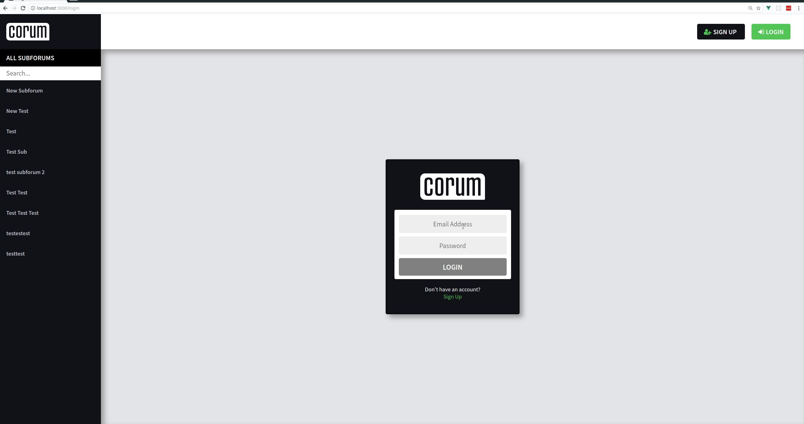

#### Unsuccessful Login Attempt

* The error message is displayed to the user when an attempt is not successful
* Once the user dismisses the error, (With the button or the enter key) they are
  free to tr again


#### Navigating to the Signup Page

* The link provided on the login page to the signup page works


### Navigation

#### Links to Subforums Work

* The links navigate to the correct subforum page
* When on a subforum, it is highlighted in the navigation

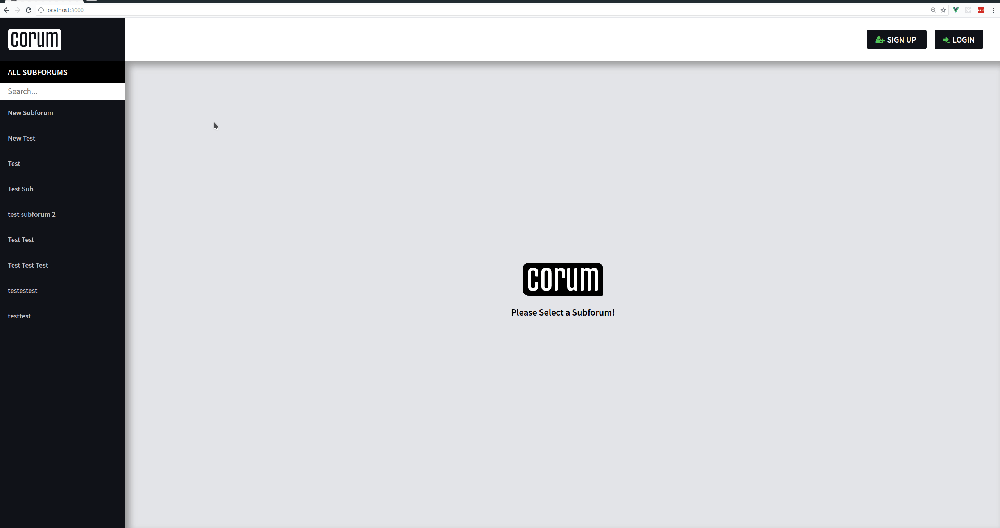

#### Search Functionality Works

* The 'All Subforums' list is filtered by the search input
* The search is case insensitive
* Mention the filtering code below (Link)
* When no items match the search term, show a message


* If the user is logged in and no items match, show a slightly different message
  with a link to create a subforum
* Link to the create a subforum page works

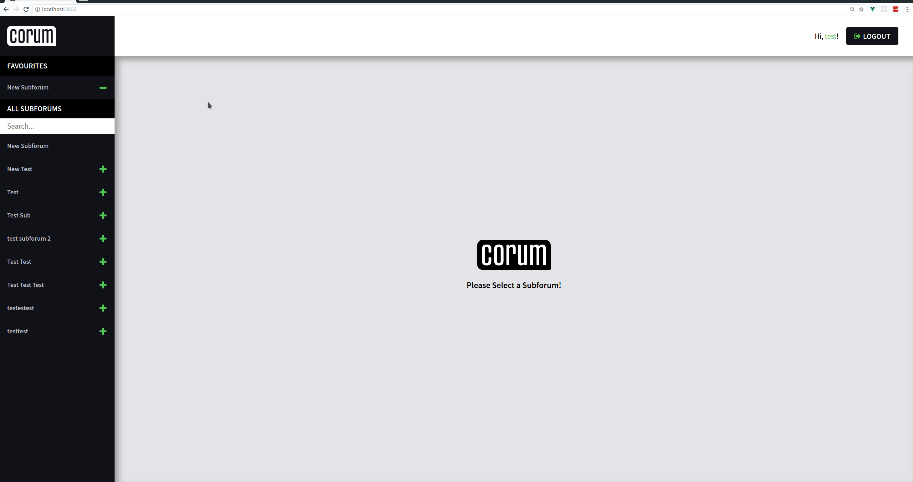

#### Navigation shows Favorites when Logged In

* When the user logs in, the navigation updates correctly
* The favorites section is not shown when a user is not logged in


#### Favorites Works

* When the user has favorites, they are displayed in the favorites section
* Each item in the favorites section has a '-' button to remove items from the
  favorites section
* Each item in the 'All Subforums' section that is not already in the favorites
  section has a '+' button to add items to the favorites section
* When the favorites section is empty, a message is shown
* The add and remove button work correctly
* The favorites are sorted correctly (Refer to sort cod below, link)

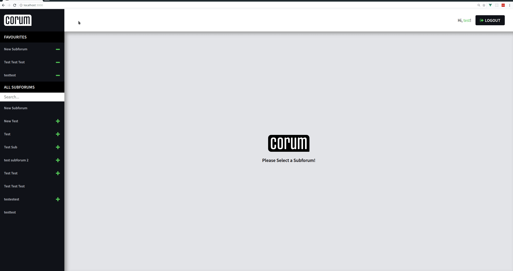

### Subforum Page

#### Empty Subforum Message

* Display a message when a subforum has no posts


#### The 'New Post' Button

* When a user is logged in, the button is clickable
* When a user is not logged in, the button is greyed out and not clickable

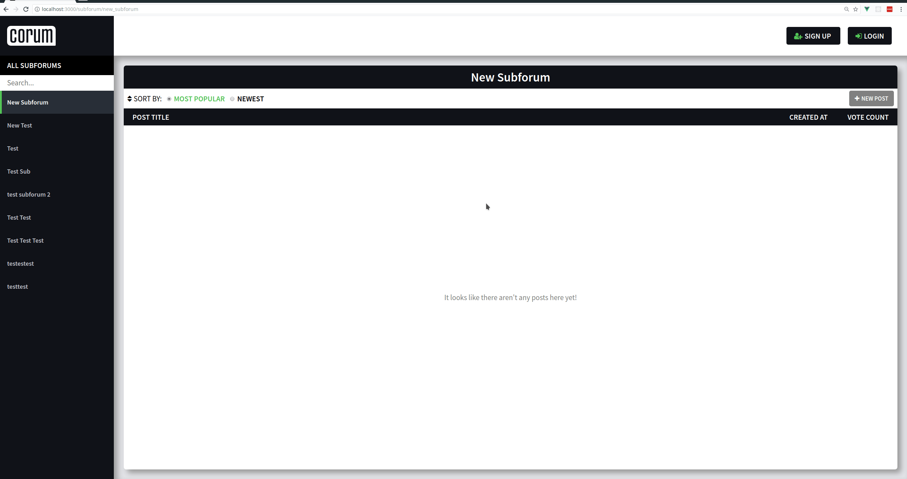

#### The Post List

* The list contains the following information about the post:
  * Post title
  * Created at
  * Vote count
* Each post in the list is a link to the post

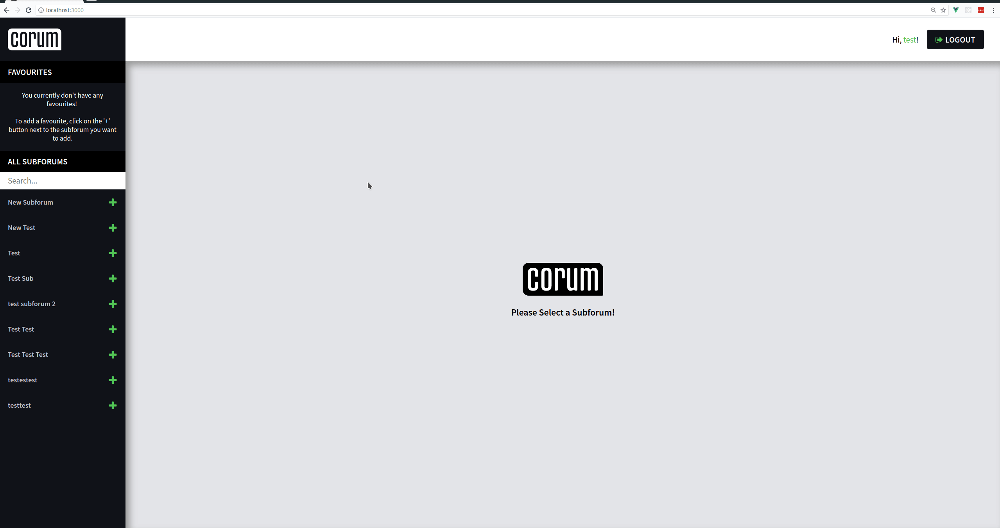

#### Sorting Functionality

* The default sorting method is by 'most popular' posts
* Both sort methods sort in descending order
* The 'most popular' sort method sorts by vote count
* The 'newest' sort method sorts by created at time and date

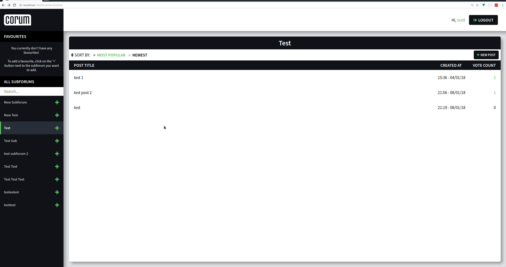

### Post Page

#### Posts are Loading Correctly

* Links from subforum pages work and post details are loaded


#### Comments Section

* If there are no comments, show a message
* You cannot comment when not logged in
* When logged in, add a section add the bottom of the page to add a comment
* When a comment is submitted, it is added to the comment section of the page
* The user cannot submit a comment when no text has been entered
* The comment count is updated correctly

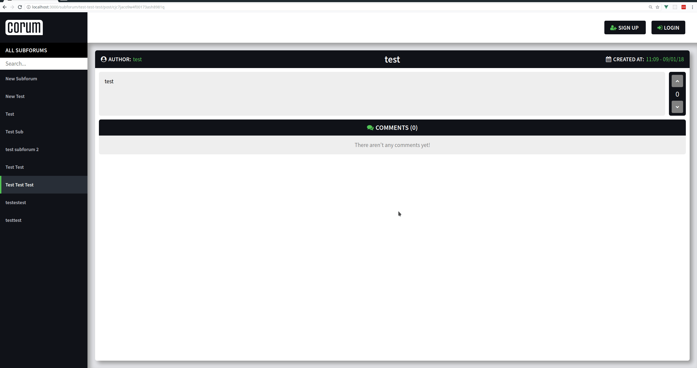

#### Post Voting

* The vote count is displayed in the top right of a post
* There is a button to upvote and a button to downvote a post
* If a user is not logged in, then vote buttons are greyed out and not clickable
* If a user is logged in, the vote buttons are clickable
* The vote count updates properly (Reference code below, link)

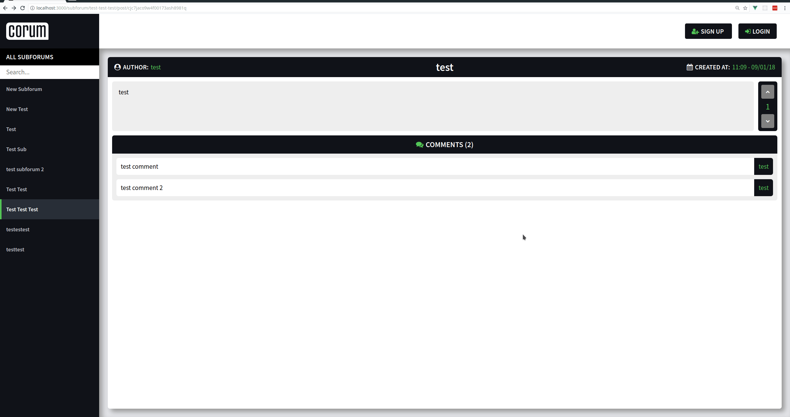

### New Post Page

* The 'New Post' button in a subforum brings the user to this page
* A new post can only be submitted when both fields are filled in
* The user is then redirected to the newly created post after they submit it
* The new post is inserted into the subforum from which the user click the 'New
  Post' button

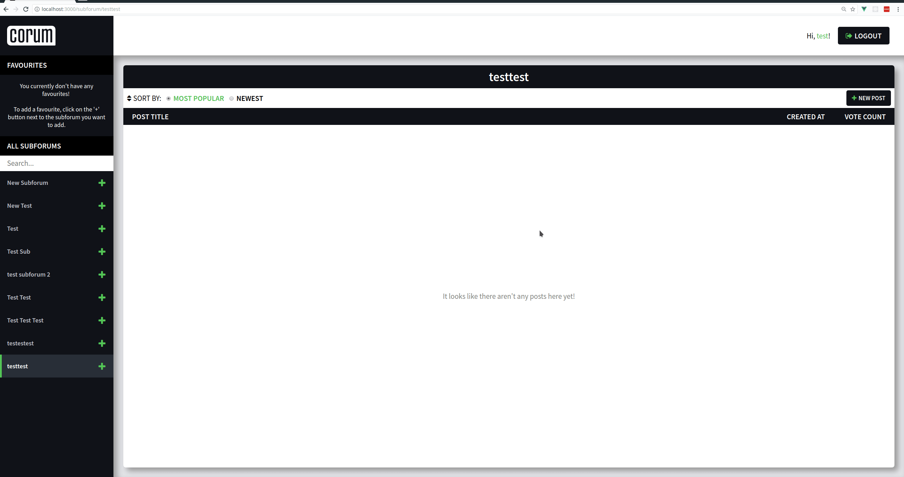

* If a user tries to visit this page when they are not logged in, an error
  message is displayed with links to either signup or login

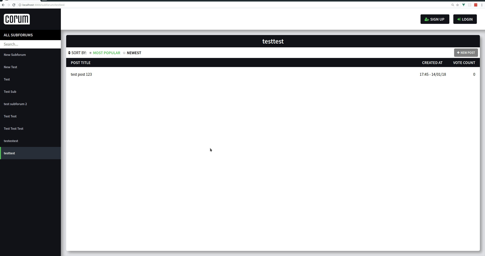

### New Subforum Page

* The only way to access this page is through the navigation when a user is
  logged in


* If the user tries to create a subforum that already exists, an error occurs

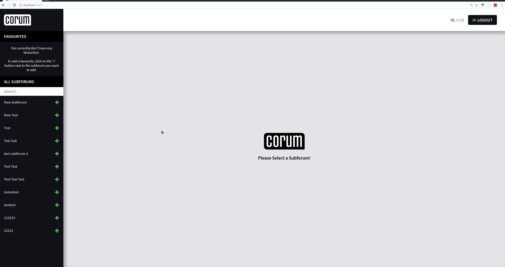

* If a user tries to visit this page when they are not logged in, an error
  message is displayed with links to either signup or login

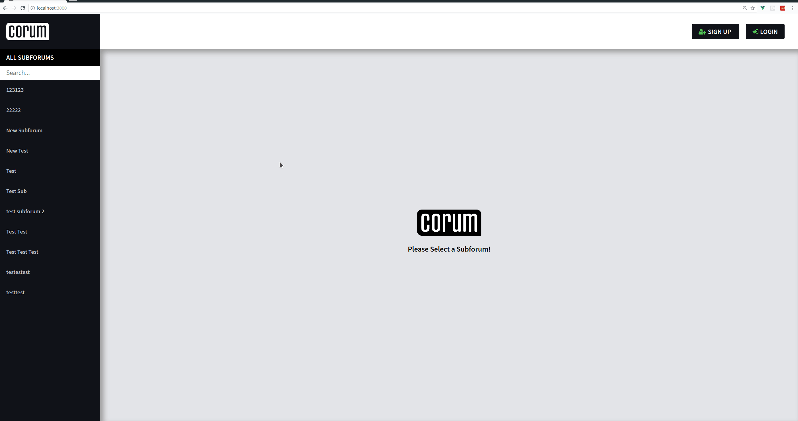

## Code Analysis

### Client Analysis

#### Nuxt configuration (`nuxt.config.js`)

```js
// For more info, visit https://nuxtjs.org/api/configuration-build

module.exports = {
  // Headers of the page
  head: {
    titleTemplate: '%s - Corum',
    meta: [
      { charset: 'utf-8' },
      { name: 'viewport', content: 'width=device-width, initial-scale=1' },
      {
        hid: 'description',
        name: 'description',
        content: 'An open, democratic & self governing forum.'
      }
    ],
    link: [{ rel: 'icon', type: 'image/png', href: '/favicon.png' }]
  },

  // CSS globals
  css: ['~/assets/styles/globals.styl'],

  // Customize the progress bar color
  // $nav-hover (Found at '~/assets/styles/variables.styl')
  loading: { color: '#53c556' },

  // Build configuration
  build: {
    // Extend the webpack config
    extend(config, { isClient, isDev }) {
      if (isClient && isDev) {
        // Run ESLint on save
        config.module.rules.push({
          enforce: 'pre',
          test: /\.(js|vue)$/,
          loader: 'eslint-loader',
          exclude: /(node_modules)/
        })
      }
    }
  },

  //  Define modules used.
  //  For more info, visit https://nuxtjs.org/guide/modules

  //  @nuxtjs/apollo - Provides vue-apollo + apollo-client
  //  @nuxtjs/dotenv - Reads .env and merges with process.env
  //  @nuxtjs/font-awesome - Provides icons
  //  @nuxtjs/pwa - Adds PWA features like offline support etc.

  //  Documentation for the modules used here can be found at:
  //  https://github.com/nuxt-community/awesome-nuxt#modules

  modules: [
    '@nuxtjs/apollo',
    '@nuxtjs/dotenv',
    '@nuxtjs/font-awesome',
    '@nuxtjs/pwa'
  ],

  // Specify the file where the apollo client config resides
  apollo: {
    clientConfigs: {
      default: '~/apollo/client-configs/default.js'
    }
  }
}
```

Please refer to the [`nuxt.config.js`](#how-nuxt-works) section located near the
top of this document for more information about what this file does and why it
exists.

These are the main section of Corum's Nuxt configuration file:

* `head`
* `css`
* `loading`
* `build`
* `modules`
* `apollo`

The following sections will describe what Corum uses them for.

##### `head`

This is where page headers are defined that will be the same across all pages.

As seen below, an useful property nuxt expose is `titleTemplate`. This allows
pages to pass their names into a template, so the page title changes between
pages. Corum's title template is `'%s - Corum'`, so for example, a post page
will have its title, followed by `'- corum'`.

This also includes things such as meta tags for character encoding and site
description. Also specified here is the link to the site's favicon.

##### `css`

This is where you can specify what CSS files you want to be added to the head of
every page, so these styles will be global to the entire site.

Corum's configuration reference a file called `globals.styl`. It contains a
basic CSS reset, as well as globals such as the base font size and font family.

The `.styl` file extension is short for stylus. Stylus is a CSS preprocessor.
(You may have heard of SASS, which is another example of a CSS preprocessor) The
fact that I am referencing a `.styl` file is important because nuxt reads the
file extension, and applies the correct loader to process this file into regular
CSS.

##### `loading`

In the GIFs files above that show how the site actually functions, you may have
noticed a small green loading bar going across the top of the page when
navigating between pages. This is a feature built into nuxt. Nuxt allows you to
customise this loading bar with CSS. Corum only changes the color of the bar to
match the overall theme.

##### `build`

The build property is where Nuxt allows you to extend its functionality. The
only thing Corum uses this for is to linting to JavaScript and Vue.

##### `modules`

This is where you defined the Nuxt modules that you want to use. Nuxt modules
are packages that features to Nuxt just by installing them and telling nuxt to
use them.

The modules used by Corum and why they are used can be found in the code
comments below.

##### `apollo`

This is exposed by the `@nuxtjs/apollo` module, and requires you to specify
where the Apollo Client configuration file resides.

#### Apollo Configuration

```js
// https://github.com/nuxt-community/apollo-module

import { ApolloLink } from 'apollo-link'
import { HttpLink } from 'apollo-link-http'
import { InMemoryCache } from 'apollo-cache-inmemory'

export default () => {
  // Create a HTTP link to the Graphcool endpoint
  const uri = process.env.API_ENDPOINT
  const httpLink = new HttpLink({ uri })

  // This middleware sends the JWT (if present) that is needed for
  // mutations such as 'createPost' or 'createComment', as only logged
  // in users are allowed to perform such mutations.

  const middlewareLink = new ApolloLink((operation, forward) => {
    /*
      Due to this being parsed SSR, process.browser must be used to
      make sure localStorage is only attempted to be accessed on the
      client. This isn't a  n issue as no queries or mutations that
      require authentication are made on an SSR request of the page.
    */
    const token = process.browser
      ? localStorage.getItem('auth-token')
      : undefined

    // Set the request headers to include the auth token
    operation.setContext({
      headers: { authorization: `Bearer ${token}` }
    })
    return forward(operation)
  })

  // Add this auth token middleware onto the HTTP link
  const link = middlewareLink.concat(httpLink)

  // Create an memory cache to be used by Apollo
  const cache = new InMemoryCache()

  return { link, cache }
}
```

To find out more about how configuring Apollo client works, visit the url that
is at the top of the code block.

As mentioned before, Apollo is used to communicate with Corum's GraphQL API.
Before Apollo can communicate the with the API, it needs to be configured. In
version 2 of Apollo Client, it was made a lot more modular. The two important
things to configure now are Apollo Links and Caches.

Apollo Links allow you to configure how GraphQL queries are handled. A common
Apollo link is `apollo-link-http` as seen below. This allows you to configure
how queries are sent over HTTP. The `apollo-link-http` package exposes a class
called `HttpLink`. As seen below, it expects and object containing the `uri` of
the API server. In Corum's case, the API endpoint address is fetched from the
`.env` file located in the root directory of the project. This means that
queries sent through Apollo are now sent to our Graphcool API.

There is also a generic Apollo link in the package `apollo-link`. This package
exposes a class called `ApolloLink`. This link allows you to modify the request
before it is sent in any way you like. (Also known as middleware) The reason
Corum needs to modify the request is so that the authentication token (if
present) is sent along with the request, allowing protected queries to be
performed. (Such as creating posts) The authentication token is fetched when the
user is logged in, and it is checked by the API before any protected queries are
performed, so it ensures that only logged in users can perform protected
queries.

Apollo Caches are used to cache data fetched from the server, so that unneeded
network requests are not made. How this works is that Apollo checks the cache
before following the Apollo Link chain. A type of Apollo Cache called
`apollo-cache-inmemory` is used by corum. This simply means that the cache is
kept in memory on the client, so it is deleted when the user goes off of the
site.

#### Navigation Component

##### `subforumSearch`

```js
// Used to produce the filtered search
subforumSearch() {
  const caseInsensitiveInput = this.search.toLowerCase()

  return this.allSubforums.filter(subforum =>
    subforum.name.toLowerCase().includes(caseInsensitiveInput)
  )
}
```

The `subforumSearch` function is used as a computed property by Vue. Computed
properties can be used in any place where component data can be used, however
the main difference is that if any of the variables that the computed property
function is referencing change, the return value of the function will get
recomputed and the code that references this computed property will update with
this new value. To find out more about computed properties, visit the following
link: [https://vuejs.org/v2/api/#computed](https://vuejs.org/v2/api/#computed)

This function is used to calculate what items match the users search term.

As this function has been taken out of context, it will be useful to know what
the variables referenced are:

* `this.search` is a string that is linked to the search box in the navigation
  and is updated when the contents of the search box changes.
* `this.allSubforums` is an array of `Subforum` objects that has been fetched by
  Apollo. These objects contain a `name` property.

To make the search case insensitive, the `toLowerCase` method on the string
prototype is called on the users search term. Then, using the `filter` method on
the array prototype and the `includes` method on the string prototype, the
subforums that match the search term are returned from the function.

##### `sortedFavorites`

```js
/*
  As graphcool doesn't support ordering by nested data, this
  computed value sorts the favorites array by subforum names.
*/
sortedFavorites() {
  if (this.allFavorites !== undefined) {
    // Spread into a new array as sort mutates original array
    return [...this.allFavorites].sort((a, b) => {
      if (a.subforum.name > b.subforum.name) {
        return 1
      } else if (a.subforum.name < b.subforum.name) {
        return -1
      } else {
        return 0
      }
    })
  } else {
    return undefined
  }
}
```

This is a Vue computed property, refer to the
[`subforumSearch`](#subforumsearch) section for more information.

Graphcool (The API framework I am using) does support ordering, (Which I have
taken advantage of when sorting posts on the subforum page) however it currently
doesn't support ordering by nested data. (As mentioned in the code comment
below) This means that instead of relying on the API to do the sorting work, I
have to perform this sorting on the client.

The reason I want the favorites to be sorted alphabetically is because
otherwise, like the `All Subforums`, it would be harder for the user to find the
subforum they are looking for when just scrolling through the list.

Variable Reference:

* `this.allFavorites` is an array of `Favorite` objects that are fetched by
  Apollo if the user is logged in. These objects contain a `Subforum` object
  with a `name` property.

Firstly, a check is made that the favorites have been fetched from the API, if
this wasn't checked, an error would be thrown. It also means that a message can
be shown to the user when the data is still loading.

If the favorites data is present, using the `sort` method on the array
prototype, a new array of `Favorite` objects is returned sorted by their
`subforum.name` property.

#### Post Page

##### `upvoteButtonClick`

```js
// Determines what GraphQL mutation to execute based on the vote state
upvoteButtonClick() {
  if (this.voteInProgress === false) {
    this.voteInProgress = true

    if (this.upvoted === true) {
      // The user has already upvoted
      this.localVote -= 1
      this.deleteVote({ id: this.userVoteData.id })
    } else if (this.downvoted === true) {
      // The user has already downvoted
      this.localVote += 2
      this.updateVote({ id: this.userVoteData.id, vote: 'VOTE_UP' })
    } else {
      // The user has not voted
      this.localVote += 1
      this.createVote({
        vote: 'VOTE_UP',
        postId: this.$route.params.post,
        userId: this.userId
      })
    }
  }
}
```

As shown in the 'Testing During Development' section, the post page has an
upvote and a downvote button in the top right of the page. These buttons are
bound to onClick event handlers called `upvoteButtonClick` and
`downvoteButtonClick` respectively. I am only explaining how the
`upvoteButtonClick` handler works as the `downvoteButtonClick` handler is very
similar, it just works in the opposite way. (For example, if the button is
pressed, then a downvote will be registered instead of an upvote)

Variable Reference:

* `this.voteInProgress` ensures that only a single vote is being processed at a
  time.
* `this.upvoted` keeps track of if the user has already upvoted the post
* `this.downvoted` keeps track of if the user has already downvoted the post
* `this.localVote` keeps track of the local vote count, this variable is needed
  because any data fetched from the API is immutable. If Corum relied on the
  data coming from the server only, then the UI would be slow to update, because
  an response from the API would be required to update the vote count displayed
  to the user
* `this.createVote`, `this.updateVote` and `this.deleteVote` are functions that
  send mutations requests to the API, these functions are described in the next
  code analysis sub section. This functionality is extracted out of the button
  click handler functions to reduce code duplication and keep the event handlers
  easier to read at a glance.

Firstly, a check is made to ensure that no vote mutations are in progress. If
any are in progress, then the button click is ignored. The reasoning behind this
check is explain in the variable reference section above. If the check passes,
then the vote mutation starts to execute. To ensure that the user cannot vote
again before the function has finished executing, `this.voteInProgress` is set
to `true`.

This function needed to handle the following scenarios:

* If the user hasn't voted already, increment the vote count on the post by 1
* If the user has already upvoted the post, decrement the vote count by 1
* If the user has already downvoted the post, increment the vote count by 2

This means that the function needs to handles the 3 possible branches, and
execute the correct code.

##### `createVote`

```js
/*
  For more info on how mutations work within vue-apollo,
  visit https://github.com/Akryum/vue-apollo#mutations
*/

// variables = { vote, postId, userId }
async createVote(variables) {
  const postId = this.$route.params.post

  try {
    await this.$apollo.mutate({
      mutation: createVoteMutation,
      variables,

      update: (store, { data: { createVote } }) => {
        const data = store.readQuery({
          query: userVoteQuery,
          variables: {
            postId,
            userId: this.userId
          }
        })

        data.allVotes.push({
          __typename: 'Vote',
          id: createVote.id,
          vote: variables.vote
        })

        store.writeQuery({
          query: userVoteQuery,
          variables: {
            postId,
            userId: this.userId
          },
          data
        })
      },

      optimisticResponse: {
        __typename: 'Mutation',
        createVote: {
          id: 0,
          __typename: 'Vote'
        }
      }
    })

    // Indicate to the page that the vote has finished execution
    this.voteInProgress = false
  } catch (error) {
    logIfDev('error', error)
  }
}
```

Like the `upvoteButtonClick` and `downvoteButtonClick` functions, the 3 vote
mutation functions `createVote`, `updateVote` and `deleteVote` are very similar.
I will only analyse the `createVote` function.

Variable Reference:

* `variables`, as mentioned at the top of the code block, is expected to be an
  object with `vote`, `postId` and `userId` properties. These pieces of data are
  needed to correctly create the vote
* `this.$apollo` is a module exposed by the `vue-apollo` package I am using for
  Vue bindings to Apollo. This is available on the global Vue instance, this
  means that is can be accessed from any `.vue` file. It exposes as method
  called `mutate` that is used to send a mutation to the API
* `createVoteMutation` is a GraphQL mutation used to create the user
* `userVoteQuery` is a GraphQL query that returns the data for a users vote
* `this.$route.params.post` contains the postId that can be seen in the browsers
  URL bar when on a post page. Like `this.$apollo`, `this.$route` is available
  on the global Vue instance. However, instead of being exposed by `vue-apollo`,
  it is exposed by the router, `vue-router`.

The whole function is just a call to the `mutate` function found on
`this.$apollo`. The `mutate` function expects an object as an argument.

While the object argument can take more properties, these are the properties I
am using:

* `mutation` - The GraphQL mutation that you want to send to the API
* `variables` - An object of variables that the mutation takes in
* `update` - The function that is called when data is returned from the API
* `optimisticUpdate` - An object that will be used in place of the real data
  before the data is returned from the API. If this property is present, then
  the `update` function passed in will be called twice. Once immediately with
  the `optimisticUpdate` object passed as the `data` parameter of the `update`
  function, and then again whenever the data is returned from the API. This
  means that the UI can be optimistically updated before the real data from the
  API is returned. Otherwise there would be a delay between pressing the vote
  button and the UI updating, which would be a bad user experience.

To show what the `update` function does, I will explain what happens when it is
called with the `optimisticUpdate` object. As shown in the `update` function
signature, the function expects the following parameters:

* `store` - This object is a reference to the Apollo cache that exists in
  memory. (That was created by the `apollo-cache-inmemory` package as seen in
  the 'Apollo Configuration' sub section) It exposes two methods that I make use
  of called `readQuery` and `writeQuery`. As evident from their names, the
  `readQuery` function takes in a query and queries the cache with it. The
  `writeQuery` takes a query and the data to be written to the cache.
* `data` - In the case of the first call of the `update` function, this is the
  `optimisticUpdate` object.

The usual flow of the `update` function is the following:

* Read the data from the cache
* Mutation the read data
* Write the data back to the cache

This function does exactly that. The data is read, the data object is mutated by
pushing the new vote onto the end of the `allVotes` array, then the mutation
data object is written back to the cache.

Most of the function's body is wrapped in a try / catch statement. This is
needed as if any errors occur, the function will gracefully handle them. For
example, if the API is not running, then an error will be logged to the console
if the app is in development mode, using the `logIfDev` function that will be
explained later on.

##### `submitComment`

```js
async submitComment() {
  const author = this.$store.state.username
  const { comment: content } = this
  const id = this.$route.params.post

  // Clears user input from textarea
  this.comment = ''

  try {
    await this.$apollo.mutate({
      mutation: createCommentMutation,
      variables: {
        author,
        content,
        id
      },

      update(store, { data: { createComment: commentData } }) {
        const data = store.readQuery({
          query: postQuery,
          variables: { id }
        })

        const newComment = {
          __typename: 'Comment',
          id: commentData.id,
          author: commentData.author,
          content: commentData.content
        }

        data.Post.comments.push(newComment)
        store.writeQuery({
          query: postQuery,
          variables: { id },
          data
        })
      },

      optimisticResponse: {
        __typename: 'Mutation',
        createComment: {
          __typename: 'Comment',
          id: 'loading',
          author,
          content
        }
      }
    })

    // scroll to bottom of page when comment is inserted
    const main = document.getElementById('main-content-wrapper')
    main.scrollTop = main.scrollHeight
  } catch (error) {
    logIfDev('error', error)
  }
}
```

Like the `upvoteButtonClick` function, this is also an event handler. This
function is called when the user clicks on the 'Post Comment' button.

Variable Reference:

* `this.$store.state.username` is a reference to the user's username.
  `this.$store` is another global Vue instance property. This is exposed by the
  `vuex` package. This allows me to store global state in Corum like user data.
* `this.comment` is a string that is linked to the comment textarea and is
  updated when the contents of the textarea changes.
* `this.$route.params.post` is a reference to the post's ID. The `this.$route`
  global is explained the 'createVote' subsection above.
* `createCommentMutation` is a GraphQL mutation that creates a comment
* `postQuery` is a GraphQL query that fetches a post's data

Just like the `createVote` function shown in the 'createVote' sub section above,
this function is mainly just a call to the `mutate` function found on
`this.$apollo`. To avoid repetition, I will not explain how this function works
again. If you don't know how it works, read the above 'createVote' sub section.

This function works in a very similar way to the `createVote` function. First,
the data required for the mutation is saved into local variables. After this,
the contents of `this.comment` is set to an empty string. This is done near the
start of the function to keep the UI feeling snappy.

Then the mutation is made. The mutation is very similar to the `createVote`
function. The update function pushes the new comment into the post's comments
array inside of Apollo's cache. After this has happened, the user is
automatically scrolled to the bottom of the page to see that their new comment
has appeared in the comments section.

Just like the `createVote` function, error handling is also present.

#### New Post Page

##### `submitPost`

```js
async submitPost() {
  const authorId = this.$store.state.userId

  const { postTitle: title, postContent: content, Subforum: { id } } = this
  /*
    For more info on how mutations work within vue-apollo,
    visit https://github.com/Akryum/vue-apollo#mutations
  */
  try {
    const { data: { createPost } } = await this.$apollo.mutate({
      mutation: createPostMutation,
      variables: {
        authorId,
        title,
        content,
        id
      }
    })

    const { subforum } = this.$route.params
    const postId = createPost.id
    this.$router.push(`/subforum/${subforum}/post/${postId}`)
  } catch (error) {
    this.$router.push(`/error`) // TODO: create actual error page
  }
}
```

Like the `submitComment` function, this is also an event handler. This function
is called when the user clicks on the 'Create Post' button on the 'New Post'
page. Also, instead of submitting a comment, it submits a post.

Variable Reference:

* `this.$store.state.userId` - explained in the `submitComment` sub section
* `this.postTitle` is a string that is linked to the title text box and is
  updated when the contents of the text box changes
* `this.postContent` is a string that is linked to the content textarea and is
  updated when the contents of the textarea changes
* `this.Subforum` contains the data of the subforum that the post is wanting to
  be created on
* `createPost` is a GraphQL mutation to create a new post
* `this.$route.params.subforum` is the ID of the subforum that the post is
  wanting to be created on
* `this.$router.push` is a function that redirects the user to a given url.

This function is a lot simpler than previous `mutate` function calls. This is
because when the new post is created, the user is redirected to the new post's
page, where the new post's data is fetched. This means that the cache doesn't
need to be manually updated as the redirect will trigger GraphQL queries that
will update the cache.

Unlike previous error handling code, this function redirects the user to an
error page.

I have left out a section explaining the `newSubforum` function on the 'New
Subforum' page because it is very similar, if not even more simple that this
function.

#### Login Page

#### `login`

```js
async login() {
  // Renders the loading submit button
  this.loading = true

  const { email, password } = this
  /*
    For more info on how mutations work within vue-apollo,
    visit https://github.com/Akryum/vue-apollo#mutations
  */
  try {
    const { data: { authenticateUser } } = await this.$apollo.mutate({
      mutation: authenticateUserMutation,
      variables: {
        email,
        password
      }
    })

    const { id, username, token } = authenticateUser
    this.$store.commit('saveUserData', { id, username, token })

    // Returns the user to the page they were on before
    // TODO: If user was on signup before, redirect to home
    this.$router.back()
  } catch ({ message }) {
    // Renders the normal submit button
    this.loading = false
    // Display the error to the user in an alert box
    alertError(message)
  }
}
```

This function is an event handler that is triggered when the users clicks on the
'Login' button on the login page. Due to the fact that the `signup` function for
the signup page is almost identical, I will not be analysing it.

Variable Reference:

* `this.loading` keeps track of if the client is currently waiting for a
  response from the API. It is used to disable the 'Login' button if it is set
  to `true` so that the user knows that page is doing something, and so that the
  user doesn't make multiple authentication requests for no reason.
* `this.email` is a string that is linked to the email text box and is updated
  when the contents of the text box changes
* `this.password` is a string that is linked to the password text box and is
  updated when the contents of the text box changes
* `authenticateUser` is a GraphQL mutation that authenticates a user
* `this.$store.commit` is a function that allows you to mutate the global state
* `this.$router.back` is a function that send the user back to the previous page
  that they were on.

This function is like many other event handlers on the site, it is basically
just a GraphQL mutation call.

If the authentication succeeds, (The user has entered the correct details) the
user's id, username and auth token is extracted from the API response and save
into the apps global state. After this, the user is redirected back to the
previous page they were on.

If the authentication fails, (The user has entered incorrect details) the
`catch` block is executed. `this.loading` is set to false so that the user can
correct the incorrect data they entered and resubmit the form. Then after this,
the error message returned from the API is cleaned up and displayed to the user
through the use of `alertError`, which will be explained later on.

#### Signup Page

##### `correctDetails`

```js
correctDetails() {
  const emailEntered = this.email !== ''

  const password1Entered = this.password1 !== ''
  const password2Entered = this.password2 !== ''
  const passwordsEntered = password1Entered && password2Entered
  const passwordsMatch = this.password1 === this.password2

  return emailEntered && passwordsEntered && passwordsMatch
}
```

placeholder

#### Utility Functions

##### `logIfDev`

```js
import stringToBoolean from '~/utils/stringToBoolean'

// Only logs to console if process.env.PROD is false

const logIfDev = (logType, message) => {
  if (stringToBoolean(process.env.PROD) === false) {
    console[logType]('test')
  }
}

export default logIfDev
```

placeholder

##### `stringToBoolean`

```js
// Helper function to handle process.env booleans

const stringToBoolean = stringBool => {
  if (stringBool === 'true') {
    return true
  } else if (stringBool === 'false') {
    return false
  } else {
    return undefined
  }
}

export default stringToBoolean
```

placeholder

##### `alertError`

```js
// Formats a GraphQL error to display to the user

export const formatError = errorMessage => {
  const colonIndex = errorMessage.lastIndexOf(':')
  const cleanedMessage = errorMessage.substring(
    colonIndex + 2,
    errorMessage.length
  )
  return cleanedMessage
}

const alertError = errorMessage => {
  const cleanedMessage = formatError(errorMessage)
  alert(`Error: ${cleanedMessage}`)
}

export default alertError
```

placeholder

#### Global Store Configuration (Vuex)

```js
import { Store } from 'vuex'
import Vue from 'vue'

// For more info, visit https://nuxtjs.org/guide/vuex-store/

/*
  Vue.set() is used to get around Vue's inability to detect the
  state change.
*/

export default () => {
  return new Store({
    // Disallow state mutation not through defined mutations
    strict: true,

    /*
      Initial state is fetched in a hook that executes on the client.
      Fetch can be found at '~/layouts/default' or '~/layouts/error'.
    */
    state: {
      userId: undefined,
      username: undefined
    },

    mutations: {
      logout(state) {
        localStorage.removeItem('user-id')
        localStorage.removeItem('username')
        localStorage.removeItem('auth-token')
        Vue.set(state, 'userId', localStorage.getItem('user-id'))
        Vue.set(state, 'username', localStorage.getItem('username'))
      },

      saveUserData(state, { id, username, token }) {
        localStorage.setItem('user-id', id)
        localStorage.setItem('username', username)
        localStorage.setItem('auth-token', token)
        Vue.set(state, 'userId', localStorage.getItem('user-id'))
        Vue.set(state, 'username', localStorage.getItem('username'))
      },

      updateUserState(state) {
        Vue.set(state, 'userId', localStorage.getItem('user-id'))
        Vue.set(state, 'username', localStorage.getItem('username'))
      }
    }
  })
}
```

placeholder

### API Analysis

#### Permission Configuration

```yml
# Where 'authenticated: true' is present in an operation,
# the client must pass along their JWT auth token in the
# request headers. (In the form -> Authorization: 'Bearer ${TOKEN}')

permissions:
    # User Permissions

    # Allows access to User from Post
    # Only the username field is made queryable. This means
    # that malicious users cannot query for someones elses
    # infomation such as their password, id, or email.
  - operation: User.read  
    fields: [username]

  # Subforum Permissions
  - operation: Subforum.create
    authenticated: true
  - operation: Subforum.read

  # Favorite Permissions
  - operation: Favorite.create
    authenticated: true
    # permission query here
  - operation: Favorite.read
  - operation: Favorite.delete
    authenticated: true
    # permission query here

  # Post Permissions
  - operation: Post.create
    authenticated: true
    # permission query here
  - operation: Post.read

  # Comment Permissions
  - operation: Comment.create
    authenticated: true
    # permission query here
  - operation: Comment.read

  # Vote Permissions
  - operation: Vote.create
    authenticated: true
    # permission query here
  - operation: Vote.read
  - operation: Vote.update
    authenticated: true
    # permission query here
  - operation: Vote.delete
    authenticated: true
    # permission query here

  # Relation Permissions
  - operation: SubforumToPost.connect
    authenticated: true
    # permission query here
  - operation: PostToComment.connect
    authenticated: true
    # permission query here
  - operation: UserToPost.connect
    authenticated: true
    # permission query here
  - operation: UserToVote.connect
    authenticated: true
    # permission query here
  - operation: PostToVote.connect
    authenticated: true
    # permission query here
  - operation: UserToFavorite.connect
    authenticated: true
    # permission query here
  - operation: SubforumToFavorite.connect
    authenticated: true
    # permission query here
```

placeholder

#### API Schema

* To avoid repetition, link to design section with the schema

#### Hook Functions

##### `userAndSubforumIsUnique`

```js
import { fromEvent } from 'graphcool-lib'
import { makeRequest } from '../../utils/common'

/*
  This is a hook function that executes every time before a favorite is created.
  It ensures that only 1 favorite of a subforum by a single user can happen.
*/

const favoriteQuery = `
query FavoriteQuery($userId: ID!, $subforumId: ID!) {
  allFavorites(
    filter: { AND: [{ user: { id: $userId } }, { subforum: { id: $subforumId } }] }
  ) {
    id
  }
}
`

export default async event => {
  // Retrieve payload from event
  const { data } = event
  const { userId, subforumId } = data

  // Create Graphcool API (based on https://github.com/graphcool/graphql-request)
  const graphcool = fromEvent(event)
  const api = graphcool.api('simple/v1')

  try {
    const { allFavorites } = await makeRequest(api, favoriteQuery, {
      userId,
      subforumId
    })

    if (allFavorites.length === 0) {
      return { data }
    } else {
      return { error: 'This user has already favorited this subforum' }
    }
  } catch (error) {
    return { error }
  }
}
```

* placeholder
* mention that there is a hook function to ensure user and post is unique but
  the functions are very similar

##### `initVoteCount`

```js
// Ensures that when a post is created, the vote Count is set to 0

export default event => {
  const { data } = event
  data.voteCount = 0
  return { data }
}
```

placeholder

##### `updateVoteCountOnVoteCreation`

```js
import { fromEvent } from 'graphcool-lib'
import {
  VOTE_COUNT_TO_DELETE_POST,
  makeRequest,
  deleteAllVotesOnPost,
  postIdFromVoteQuery,
  currentPostVoteCount,
  getAllVoteIdsOnPost,
  deleteVote,
  deletePost,
  updatePost
} from '../../utils/common'

/*
  This is a hook function that executes every time after a vote is created.
  It updates the voteCount field on the post to reflect the vote creation.
  Also, if the new vote count is equal or less than the VOTE_COUNT_TO_DELETE_POST
  constant, then the post will be deleted (The automated management system)
*/

export default async event => {
  // Retrieve payload from event
  const { data } = event
  const voteId = data.id
  const voteType = data.vote

  // Create Graphcool API (based on https://github.com/graphcool/graphql-request)
  const graphcool = fromEvent(event)
  const api = graphcool.api('simple/v1')

  try {
    const { Vote } = await makeRequest(api, postIdFromVoteQuery, { voteId })
    const postId = Vote.post.id

    const { Post } = await makeRequest(api, currentPostVoteCount, { postId })
    const oldVoteCount = Post.voteCount

    let newVoteCount
    if (voteType === 'VOTE_UP') {
      newVoteCount = oldVoteCount + 1
    } else if (voteType === 'VOTE_DOWN') {
      newVoteCount = oldVoteCount - 1
    } else {
      return Promise.reject('voteType is not defined')
    }

    if (newVoteCount <= VOTE_COUNT_TO_DELETE_POST) {
      await deleteAllVotesOnPost(api, postId)
      return await makeRequest(api, deletePost, { postId })
    } else {
      return await makeRequest(api, updatePost, { postId, newVoteCount })
    }
  } catch (error) {
    return { error }
  }
}
```

* placeholder
* mention how there are also the other hook functions for delete and update

#### Resolvers

##### `authenticate`

```js
import { fromEvent } from 'graphcool-lib'
import * as bcryptjs from 'bcryptjs'
import { makeRequest } from '../../utils/common'

const userQuery = `
  query UserQuery($email: String!) {
    User(email: $email) {
      id
      password
      username
    }
  }
`

export default async event => {
  try {
    // Retrieve payload from event
    const { email, password } = event.data

    // Create Graphcool API (based on https://github.com/graphcool/graphql-request)
    const graphcool = fromEvent(event)
    const api = graphcool.api('simple/v1')

    // Check if a user exists with the email entered
    const { User } = await makeRequest(api, userQuery, { email })
    if (!User) {
      return { error: 'Invalid credentials!' }
    }

    // Check if the user entered the correct password for the user
    const passwordIsCorrect = await bcryptjs.compare(password, User.password)
    if (!passwordIsCorrect) {
      return { error: 'Invalid credentials!' }
    }

    // Generate auth token
    const { id, username } = User
    const token = await graphcool.generateAuthToken(id, 'User')

    // Return the payload the user asked for
    return {
      data: {
        id,
        username,
        token
      }
    }
  } catch (error) {
    return { error }
  }
}
```

placeholder

##### `signup`

```js
import { fromEvent } from 'graphcool-lib'
import * as bcryptjs from 'bcryptjs'
import * as validator from 'validator'
import { makeRequest } from '../../utils/common'

const userQuery = `
  query UserQuery($email: String!, $username: String!) {
    allUsers(filter: { OR: [{ email: $email }, { username: $username }] }) {
      id
      password
      email
      username
    }
  }
`

const createUserMutation = `
  mutation CreateUserMutation(
    $username: String!
    $email: String!
    $passwordHash: String!
  ) {
    createUser(username: $username, email: $email, password: $passwordHash) {
      id
    }
  }
`

export default async event => {
  // Retrieve payload from event
  const { username, email, password } = event.data

  // Create Graphcool API (based on https://github.com/graphcool/graphql-request)
  const graphcool = fromEvent(event)
  const api = graphcool.api('simple/v1')

  const SALT_ROUNDS = 10

  try {
    // Check is email is valid
    if (validator.isEmail(email) === false) {
      return { error: 'The email address entered is not valid' }
    }

    // Fetch all users that match the users input (if any)
    const { allUsers } = await makeRequest(api, userQuery, { email, username })

    // If no users exists with the same details, create the user
    if (allUsers.length === 0) {
      // Generate the password hash that will be stored in the DB
      const passwordHash = await bcryptjs.hash(password, SALT_ROUNDS)

      // Create the user
      const { createUser } = await makeRequest(api, createUserMutation, {
        email,
        username,
        passwordHash
      })

      // Generate auth token
      const { id } = createUser
      const token = await graphcool.generateAuthToken(id, 'User')

      // Return the payload the user asked for
      return {
        data: {
          id,
          token
        }
      }
    }

    // If any users do exist, throw the correct informative error
    if (
      allUsers.length === 2 ||
      (allUsers[0].email === email && allUsers[0].username === username)
    ) {
      return { error: 'The email address and username are in use' }
    } else if (allUsers[0].email === email) {
      return { error: 'The email address is in use' }
    } else if (allUsers[0].username === username) {
      return { error: 'The username is in use' }
    } else {
      return { error: 'An unknown error occured' }
    }
  } catch (error) {
    return { error }
  }
}
```

placeholder

#### Utility Functions and Constants

##### `VOTE_COUNT_TO_DELETE_POST`

```js
export const VOTE_COUNT_TO_DELETE_POST = -1
```

This number determines the amount of votes required for the post to be deleted
by the automatic post management system.

##### `makeRequest`

```js
/*
  A wrapper around the fromEvent(event).request that is provided
  by 'graphcool-lib' to handle errors in query responses.
*/
export const makeRequest = async (api, query, variables) => {
  const queryResult = await api.request(query, variables)

  if (queryResult.error) {
    return Promise.reject(queryResult.error)
  } else {
    return queryResult
  }
}
```

placeholder

##### `deleteAllVotesOnPost`

```js
/*
  Currently, the CRUD API generated by graphcool does not expose a
  query that allows you to update or delete multiple data records at
  once.

  It looks like this feature is coming in the graphcool 1.0 release.
  https://github.com/graphcool/framework/issues/81

  In the meantime, this function will be used to delete all the Votes
  on a Post record. This is required because graphcool doesn't allow
  you to delete records that would leave other records orphans.

  In the case of the Post type, if it was deleted, it would leave the
  Vote records that reference the Post, orphans. To allow us to delete
  a post, we must first delete the Votes that reference it.
*/
export const deleteAllVotesOnPost = async (api, postId) => {
  const { allVotes } = await makeRequest(api, getAllVoteIdsOnPost, { postId })
  const voteIdList = allVotes.map(vote => vote.id)

  return await Promise.all(
    voteIdList.map(voteId => {
      return makeRequest(api, deleteVote, { voteId })
    })
  )
}
```

placeholder
